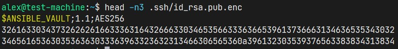
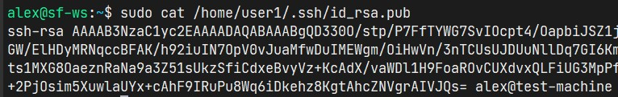
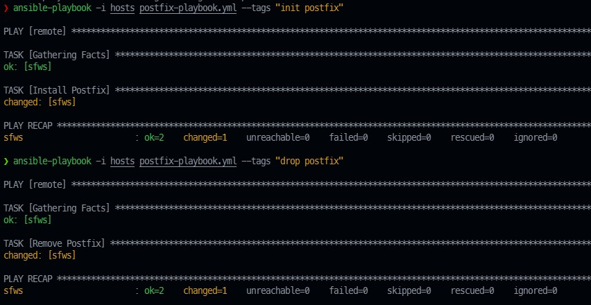
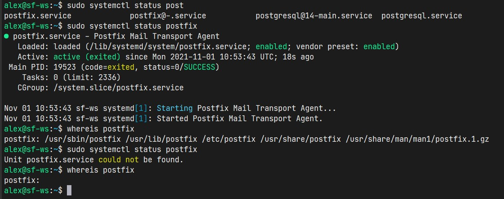

### Задание B10.5.1

1. Напишите плейбук, который будет на удаленной системе создавать пользователя user1 и задавать ему SSH-ключ (создавая заданный ключ в /home/user1/.ssh/id_rsa.pub). Ключ не должен передаваться в открытом виде. Используйте для шифрования ключа ansible-vault. Ключ можете сгенерировать, используя SSH-keygen.
2. Создайте плейбук, который устанавливает, либо удаляет почтовый сервер postfix в зависимости от тега.
   
   - При запуске ansible-playbook <путь_к_плейбуку> --tags init postfix должен устанавливаться и запускаться с конфигурацией по умолчанию. 
   - При запуске ansible-playbook <путь_к_плейбуку> --tags drop postfix должен удаляться с машины.

---

Решение:

1. [Create user](../B10.5.1/adduser-playbook.yml) via `ansible-playbook --vault-password-file ./.vault-pass -i hosts adduser-playbook.yml`

1. [Postfix](../B10.5.1/postfix-playbook.yml) via:
   - `ansible-playbook -i hosts postfix-playbook.yml --tags "init postfix"` 
   - `ansible-playbook -i hosts postfix-playbook.yml --tags "drop postfix"`

