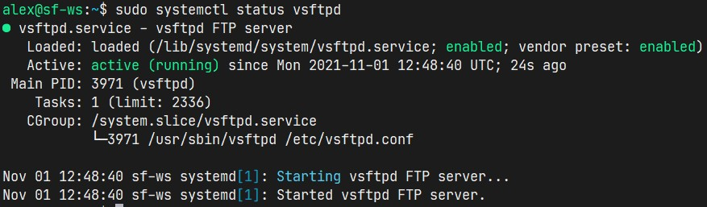
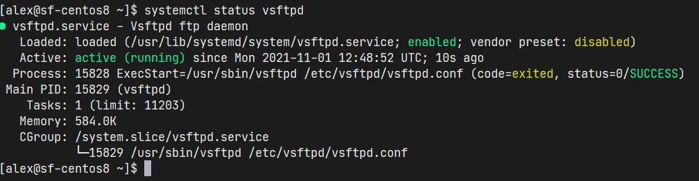
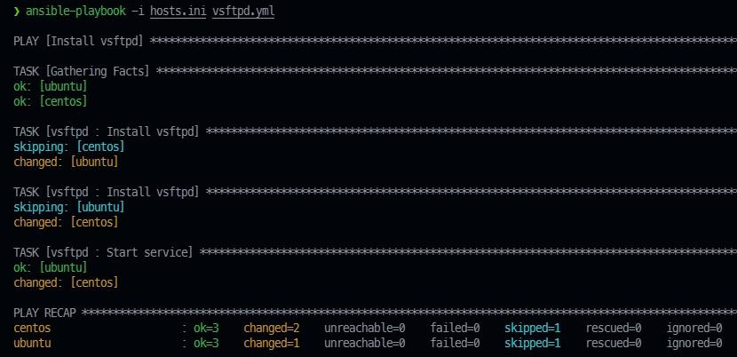

### Задание B10.6.1

Создайте Ansible-роль, устанавливающую и запускающую FTP-сервер vsftpd.

---

Решение: `ansible-playbook -i hosts.ini vsftpd.yml`

Из роли убрал лишнее, не относящиеся к заданию.

Скриншоты:

