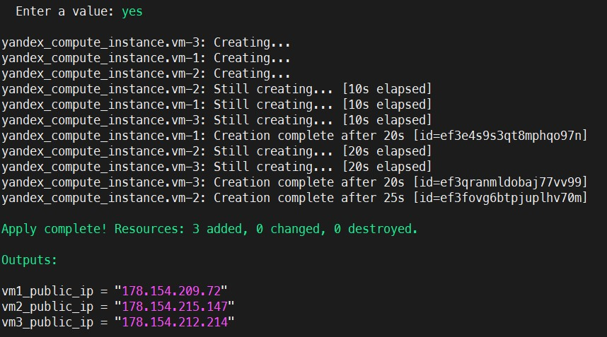
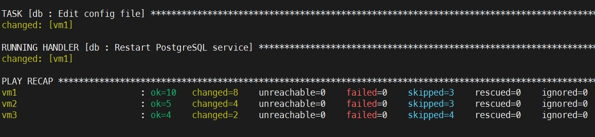
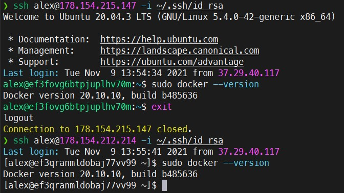
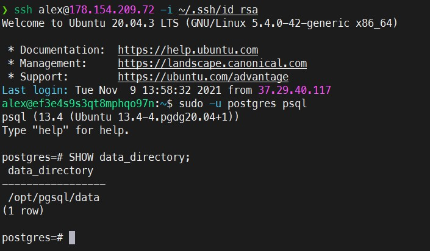

### Проектная работа 10

#### Что нужно сделать: 

1. Создать 3 ВМ в Я.Облаке (минимальная конфигурация: 2vCPU, 2GB RAM, 20 GB HDD): vm1 и vm2 (Ubuntu 20.04), vm3 (Centos 8).
2. Установить на vm1 Ansible.
3. Создать на vm1 пользователя для Ansible.
4. Настроить авторизацию по ключу для этого пользователя с vm1 на vm2 и vm3.
5. Добавить в inventory информацию о созданных машинах. vm2 и vm3 должны быть в группе app, vm1 — в группе database и web.
6. Написать плейбук, реализующий следующее:
   - на машинах группы app выполняется установка и запуск Docker;
   - на машинах группы database выполняется установка и запуск postgresql-server (версия и data-директория должны быть переменными, задающимися в inventory).
7. Протестировать написанный плейбук.

---

#### Решение:

1. Создание ВМ реализованно через [Terraform](../PW10/terraform/yandex.tf)
6. [Playbook](../PW10/ansible/pw10.yml)

Screenshots

 

   
    
   
    
   
    
   
   

---

> Пункты 2,3,4 я решил упустить, так как не вижу в них смысла. Это получится управление с упарвляемого хоста.
> 
> Так же в [Terraform-манифесте](../PW10/terraform/yandex.tf) есть закомментированные строки, в этом куске кода запускается скрипт на питоне для генерации [инвентори файла](../PW10/ansible/hosts_auto.ini) для ансибла, и после запускается плейбук. Т.е. все задания выполняется одной командой `terraform apply` =)
> Скорее всего это плохая практика, но это ради эксперимента.