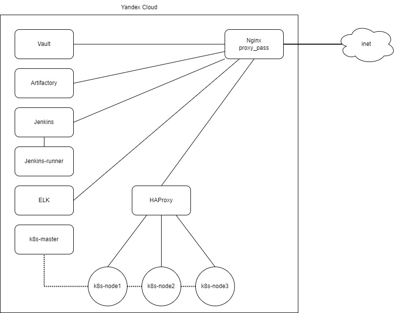
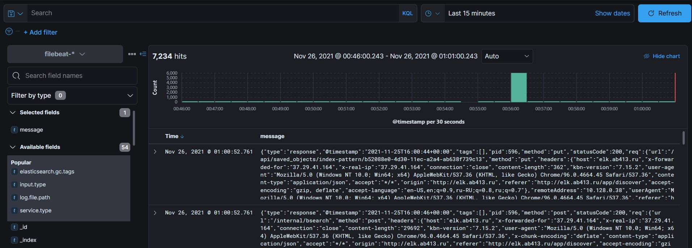
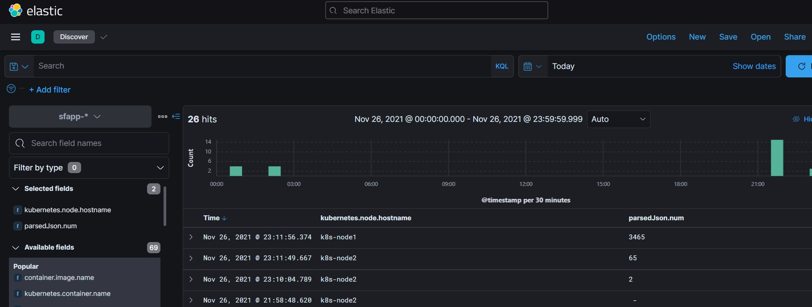
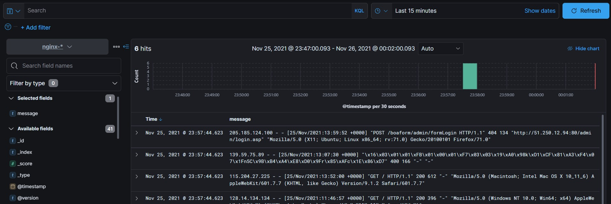
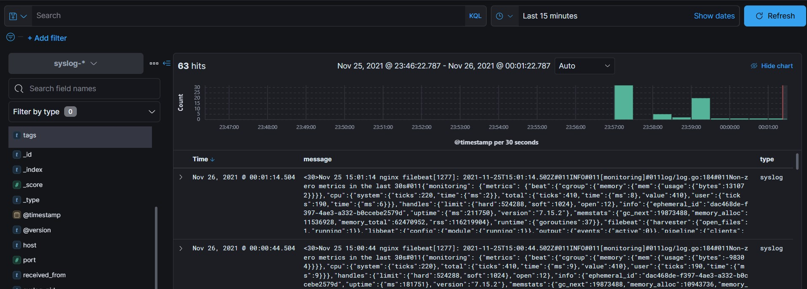

## ПРОЕКТНАЯ РАБОТА 11

1. Создать в Я.Облаке две ВМ:
   - одну для ELK-стека (VM1), минимальные требования для VM1: 2vCPU, 8GB RAM, 100GB HDD;
   - вторую в качестве машины, генерирующей логи (VM2), минимальные требования для VM2: 2vCPU, 4GB RAM, 30GB HDD.
2. Установить и запустить на VM1 связку ElasticSearch + Logstash + Kibana.
3. Настроить на VM2 пересылку syslog-сообщений (/var/log/syslog в Ubuntu и /var/log/messages в CentOS) на VM1.
4. Дополнительно поднять на ВМ nginx и настроить отправку логов также на VM1.

## Задания B11.9.1-3

- B11.9.1 Разверните на Server2 Elasticsearch+Kibana. Настройте визуализацию логов Kibana на ней самой.

- B11.9.2 Напишите приложение (на удобном для вас языке программирования), получающее на вход число, а на выходе выдающее это число удвоенным.
- B11.9.2 Примените библиотеку журналирования, которая будет записывать в лог дату, время и введенное число. Лог должен быть в JSON-формате. 

- B11.9.3 1) Настройте на Server1 с помощью RSyslog отправку логов из п. 2 в Elasticsearch на Server2.
- B11.9.3 2) Проверьте через Kibana, что логи доставляются (в пункте Discover).

---

## Решение

Решил усложнить себе задачу.

В Я.Облаке я создал (пока руками) инфраструктуру за весь срок обучения на курсе, т.е. это:
- Artifactory
- Jenkins + runner
- k8s кластер из 1 мастера и 3 ноды
- ELK stack

Настроил доступ к ресурсам через одну точку входа (Nginx). 

Схема ифраструктуры

### По заданию ПР 11:
- ELK stack установлен на `VM elk`
- syslog отправляется с `VM nginx` через tcp
- nginx-логи отправляется с `VM nginx` через filebeat

### По заданиям модуля B11.9
- [Приложение](../PW11/app.py) [собирается](../PW11/Dockerfile) (пока что руками) в докер-контейнер и через [манифест](../PW11/k8s/sfapp.yml) деплоится в k8s кластер и отправляет логи в `stdout`, их собирает и отправляет filebeat ([манифест](../PW11/k8s/filebeat.yml))

### Конфиги

- Настройки Elasticsearch и Kibana по-умолчанию.
- [Logstash](../PW11/logstash/conf.d/02-test.conf)
- [HAProxy](../PW11/haproxy/haproxy.cfg)
- Nginx: [elk](../PW11/nginx/elk), [app](../PW11/nginx/app)

  

Screenshots

 

   <h3>Логи Кибаны</h3>
   
    
   <h3>Логи приложения</h3>
   
    
   <h3>Логи Nginx</h3>
   
    
   <h3>Логи syslog</h3>
   
   

