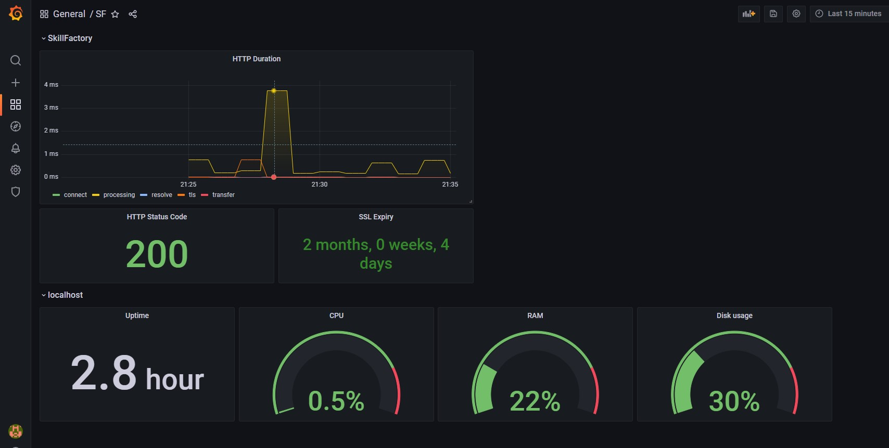
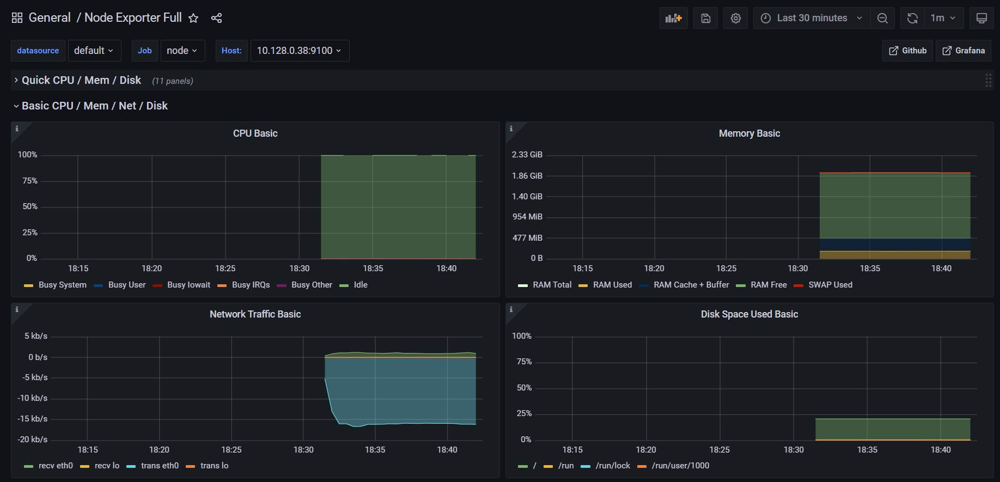

## Проектная работа 12 и Задание B12.10 

### B12.10 

1. Разверните Prometheus Stack через docker-compose, в котором будет:
   - Prometheus,
   - Grafana,
   - Node Exporter,
   - Blackbox Exporter,
   - AlertManager.

2. Соберите метрики с `https://lms.skillfactory.ru` через Blackbox, соберите метрики с вашего сервера через Node Exporter.

3. Создайте dashboard в Grafana, в котором будут отображены следующие метрики:

На вашем сервере (или локальной машине):

- время работы (Uptime);
- нагрузка на процессор (CPU) в %;
- использование памяти (RAM) в %;
- использование диска в %.

На `lms`.skillfactory.ru`:

- возвращаемый статус-код;
- задержка ответа сайта;
- срок действия сертификата.
  
4. Добавьте алерты в AlertManager на следующие события:
   - изменился статус-код сайта `lms.skillfactory.ru`,
   - задержка превышает 5 секунд `lms.skillfactory.ru`,
   - сервер перезагрузился (через метрику Uptime).

---

### PW12

1. Создать две ВМ в Я.Облаке:
   - одна будет сервером мониторинга (VM1), минимальные требования для VM1: 2vCPU, 8GB RAM, 50GB HDD.
   - другая будет содержать nginx, который мы будем мониторить (VM2), минимальные требования для VM2: 2vCPU, 4GB RAM, 30GB HDD.
2. Установить и запустить на VM2 Prometheus Node Exporter.
3. Установить Prometheus Server на машину для VM2.
4. Настроить Prometheus Server так, чтобы он собирал метрики с VM2 с настроенным Node Exporter.
5. Запустить Prometheus Server.
6. Проверить с помощью PromQL-запроса корректность собираемых данных.
7. Установить и запустить Grafana на машине рядом с Prometheus.
8. Создать в Grafana новый источник данных – нашу инсталляцию Prometheus.
9. Создать в Grafana новый дашборд с любыми метриками. Как вариант — использование процессора.

---

## Решение

[Grafana](http://grafana.ab413.ru)

[Prometheus config](../PW12/prometheus/prometheus.yml)

[Alertmanager config](../PW12/alertmanager/config.yml)

[Alert rules](../PW12/prometheus/alert.rules)

Screenshots

 

   <h3>Dashboard for B12.10</h3>
   
    
   <h3>Dashboard for PW12</h3>
   

